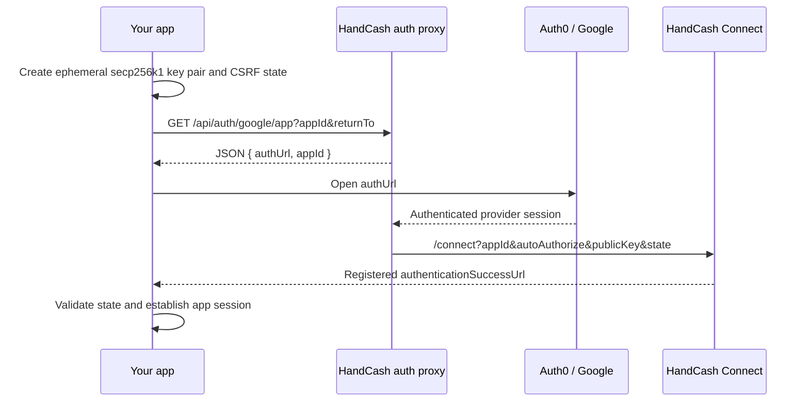

## What it does

Your app can offer **Sign in with Google** without registering its own Google
OAuth client. HandCash owns the Google/Auth0 integration and returns a login
URL. Once Google authenticates the user, HandCash Connect authorizes your app
and returns to the success URL registered in the Developer Dashboard.

Your app never receives a Google authorization code, access token, refresh
token, client ID, or client secret.

<Info>
This is a convenience entry point into the standard
[Connect authentication](/v3/connect/authentication) flow — it produces a
HandCash Connect authorization and does not grant your app access to the
user's Google account.
</Info>

## Flow



## Prerequisites

1. Create a HandCash Connect app in the
   [Developer Dashboard](https://dashboard.handcash.io).
2. Set its authentication success URL to
   `https://<your-host>/auth/callback`.
3. Configure your backend:

```bash
HANDCASH_APP_ID=...
HANDCASH_APP_SECRET=...
HANDCASH_MARKET_URL=https://handcash.io
```

Use `https://preprod-market.handcash.io` only with matching preproduction app
credentials.

## Start the flow

On your backend:

1. Create a cryptographically random, single-use CSRF value.
2. Create a one-time secp256k1 key pair.
3. Store the private key and CSRF record in `HttpOnly`, `SameSite=Lax` cookies.
   Use `Secure` outside local HTTP development and expire both within 10–30
   minutes.
4. Build this **proxy-relative** return path:

```text
/connect
  ?appId=<HANDCASH_APP_ID>
  &autoAuthorize=true
  &publicKey=<compressed-public-key-hex>
  &state=<csrf-value>
```

Then request:

```http
GET https://handcash.io/api/auth/google/app
  ?appId=<HANDCASH_APP_ID>
  &returnTo=<url-encoded-connect-path>
Accept: application/json
```

The response is:

```json
{
  "authUrl": "https://handcash.io/api/auth/login?returnTo=...&connection=google-oauth2",
  "appId": "<HANDCASH_APP_ID>"
}
```

Return `authUrl` to browser JavaScript. Never return the temporary private key.

<Warning>
`returnTo` is a path on HandCash, **not your callback URL**. External and
protocol-relative URLs are rejected to prevent open redirects. Connect obtains
the eventual callback from your app's registered `authenticationSuccessUrl`.
</Warning>

## Open the login URL

Open `authUrl` in a popup on desktop. On mobile—or when popup creation is
blocked—use a top-level navigation.

The proxy selects Auth0's `google-oauth2` connection and resumes `/connect`
after login. `autoAuthorize=true` removes an unnecessary second click when
policy permits it; it does not bypass Connect consent, signing-key, or 2FA
requirements.

## Complete your callback

At `GET /api/auth/callback` on your origin:

1. Compare returned `state` to the short-lived CSRF cookie. Fail closed on a
   missing, expired, reused, or mismatched value.
2. Require the temporary private-key cookie.
3. Validate the Connect authorization by loading the current user profile with
   `HANDCASH_APP_ID`, `HANDCASH_APP_SECRET`, and the temporary private key.
4. Establish your application session.
5. Delete the temporary key and CSRF cookies.

The temporary private key is the Connect credential generated by your app. It
is not a Google credential.

## Endpoint distinction

| Endpoint | Intended caller | Result |
|---|---|---|
| `GET /api/auth/google/app` | Connected applications | JSON `{ authUrl, appId }` |
| `GET /api/auth/google` | HandCash itself | `302` into HandCash's Google login |

Applications must call the `/app` endpoint.

## Common failures

| Symptom | Cause |
|---|---|
| HTML instead of JSON | Wrong Market host or `/app` endpoint is not deployed |
| Callback has no temporary cookie | Success URL host differs from the initiating host (`www`, apex, or scheme) |
| Flow returns to `/` | `returnTo` was absolute, protocol-relative, or rejected |
| Login works but Connect does not authorize | App ID, dashboard URLs, signing key, or 2FA state is invalid |
| HTTP 400 | `appId` was omitted |
| HTTP 500 | Proxy-side Auth0 configuration is unavailable |

## Reference implementation

Soundbase is the app-side reference:

- `app/api/auth/google/route.ts` — start;
- `app/api/auth/callback/route.ts` — validate and establish the session;
- `contexts/auth-context.tsx` — popup and mobile fallback;
- `lib/auth-utils.ts` — ephemeral key generation.

HandCash Market implements the proxy at
`src/app/api/auth/google/app/route.ts`.

## Security requirements

- The proxy validates `returnTo` against its own origin.
- Your app binds one state and one ephemeral key to one short-lived flow.
- The private key never appears in a URL or client-readable storage.
- Your callback validates the Connect credential before issuing a session.
- The proxy never forwards Google tokens to your app.
- Popup completion checks `event.origin`; popup closure alone is not proof of
  successful login.

Once the callback completes you hold an ordinary Connect authorization — see
[Authentication](/v3/connect/authentication) for permissions and session
handling.
