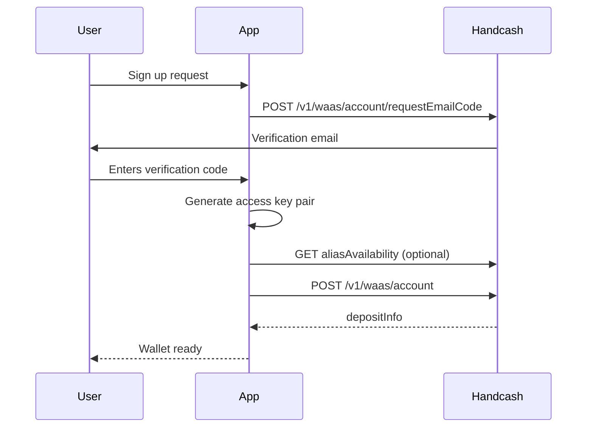

Create embedded wallets with the Wallet API REST endpoints. Generate a secp256k1 **access key pair** on your server before starting.

**Base URL:** `https://cloud.handcash.io`  
**Headers (account steps):** `app-id`, `app-secret`, `Content-Type: application/json`

<Info>
Wallet creation must be enabled for your App ID. Contact [sales@handcash.io](mailto:sales@handcash.io) if account creation fails with a feature or limit error.
</Info>

## Step 1: Request email verification

```http
POST /v1/waas/account/requestEmailCode
```

```json
{ "email": "user@example.com" }
```

The user receives a verification code by email. Complete that flow before creating the account (HandCash validates the email when you call create account).

## Step 2: Generate an access key pair

```javascript
import { secp256k1 } from '@noble/curves/secp256k1';

const privateKey = secp256k1.utils.randomPrivateKey();
const privateKeyHex = Buffer.from(privateKey).toString('hex');
const publicKeyHex = Buffer.from(secp256k1.getPublicKey(privateKey, false)).toString('hex');
// Store privateKeyHex securely for this user — it signs all wallet API calls.
```

You can use `@noble/curves` only for key generation; Wallet API wallet calls do not require `@handcash/sdk`.

## Step 3: Check alias availability (optional)

```http
GET /v1/waas/account/aliasAvailability/{alias}
```

## Step 4: Create the wallet account

```http
POST /v1/waas/account
```

```json
{
  "email": "user@example.com",
  "alias": "myuser",
  "accessPublicKey": "<hex-public-key>"
}
```

Response includes deposit info (paymail, address, etc.). See OpenAPI schema `wallet-depositInfoSchema`.

```javascript
const res = await fetch('https://cloud.handcash.io/v1/waas/account', {
  method: 'POST',
  headers: {
    'Content-Type': 'application/json',
    'app-id': process.env.HANDCASH_APP_ID,
    'app-secret': process.env.HANDCASH_APP_SECRET,
  },
  body: JSON.stringify({
    email: 'user@example.com',
    alias: 'myuser',
    accessPublicKey: publicKeyHex,
  }),
});
const depositInfo = await res.json();
```

## Step 5: Wallet operations

Use the access **private** key to [sign requests](/wallet-api/request-signing) for `/v1/waas/wallet/*` — balances, pay, transactions, etc. See [Wallet operations](/wallet-api/manage-wallets).

## Sequence diagram


